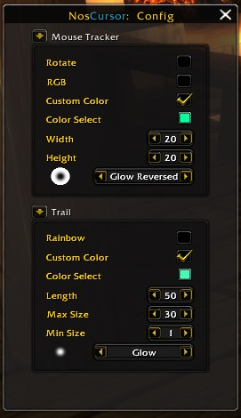
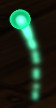

# NosCursor

The most advanced but also lightweight cursor tracker for vanilla 1.12 client.

The objective of this addon is to give players the ability to keep track of there cursor when the **** hits the fan.




## Installation
1. Download **[Latest Version](https://github.com/Beardedrasta/NosCursor/archive/main.zip)**
2. Unpack the Zip file into your wow addons folder
3. Rename the folder "NosCursor-main" to "NosCursor"
4. Restart WoW

## Commands

You can use the following command to access the config settings:
* **/noscursor config**
* **/nc config**

Config options and there uses:
### Mouse Tracker
```
Rotate                  [Makes the tracker texture rotate in a circle]
RGB                     [Colors the tracker texture with RGB animation]
Custom Color            [Colors the tracker texture the set custom color]
Color Select            [Option to select the custom color for the tracker]
Width                   [Sets the width of the tracker]
Height                  [Sets the height of the tracker]
Texture                 [Sets the tracker texture]
```

### Trail
```
Rainbow                 [Colors the trail with rainbow animation]
Custom Color            [Colors the trail the set custom color]
Color Select            [Option to select the custom color for the trail]
Length                  [Sets the length of the trail]
Max Size                [The max size of the cursor end of the trail]
Min Size                [The min size of the tail end of the trail]
Texture                 [Sets the trail texture]
```


